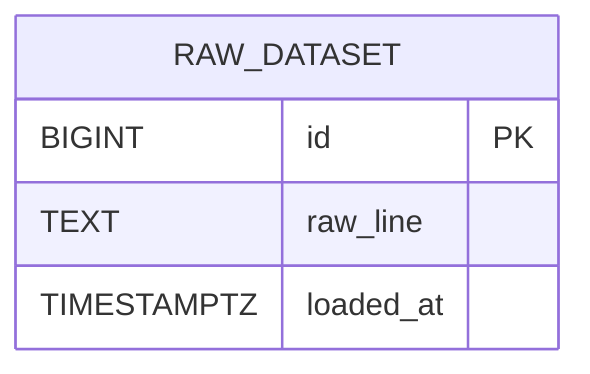
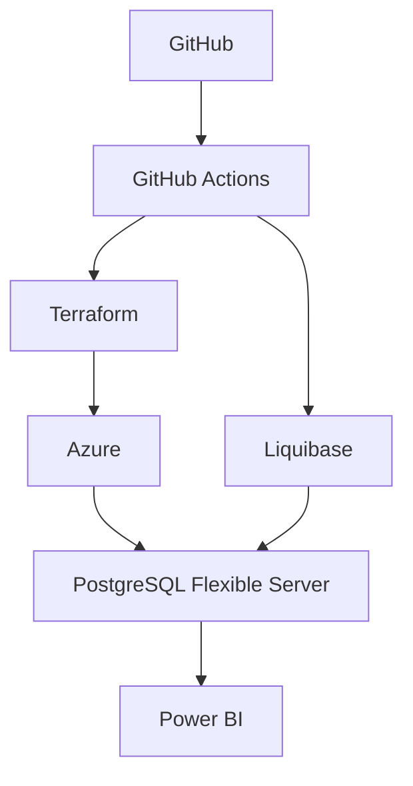

# Proyecto BI - Niñas, Niños y Adolescentes en Servicio de Acogimiento Residencial

## 1. Integrantes

- Diego Fabrizio Andia Navarro

## 2. Descripción del proyecto

Este proyecto tiene como objetivo construir una solución de Business Intelligence para analizar los datos oficiales del servicio de acogimiento residencial para niñas, niños y adolescentes en Perú. La solución contempla la creación de infraestructura en la nube, carga de datos en PostgreSQL, migraciones con Liquibase, automatización mediante GitHub Actions y visualización de indicadores con Power BI.

El repositorio está estructurado para mantener una base reproducible y documentada, con automatización para infraestructura, setup de base de datos y despliegue del reporte.

## 3. Fuente del dataset

Fuente oficial del gobierno del Perú:

https://www.datosabiertos.gob.pe/dataset/ni%C3%B1as-ni%C3%B1os-y-adolescentes-atendidos-en-el-servicio-de-acogimiento-residencial-por

## 4. Detalle del dataset

Se debe descargar el archivo oficial del portal y almacenarlo dentro de `data/raw/`.

### Estado real de acceso desde Codespaces

Desde este entorno no se logró validar el archivo real de forma automatizada porque el portal oficial devuelve un bloqueo HTTP 418/CloudWAF al intentar descargarlo. Por esa razón, este repositorio NO asume columnas, tipos ni registros inventados.

### Qué se debe revisar una vez se descargue el dataset real

- nombre exacto del archivo
- formato del archivo (`csv`, `xlsx`, `zip`, etc.)
- cantidad aproximada de registros
- columnas disponibles
- tipos de datos reales
- claves candidatas
- campos temporales y categóricos
- relaciones potenciales entre tablas

### Variables a validar en la fuente oficial

- campos categóricos
- campos numéricos
- campos de fecha/año
- campos geográficos o administrativos
- identificadores únicos o de entidad

## 5. Diccionario de datos

La validación exacta del diccionario debe ejecutarse cuando el archivo oficial se encuentre disponible en `data/raw/`.

| Campo | Tipo | Descripción |
| --- | --- | --- |
| Pendiente de validación | No disponible | El portal oficial bloquea la descarga desde Codespaces; el archivo real aún no fue inspeccionado para confirmar columnas y tipos. |

## 6. Arquitectura

La solución está compuesta por estos componentes:

- GitHub: repositorio del proyecto y control de versiones.
- GitHub Actions: automatización de infraestructura, configuración, carga y despliegue.
- Terraform: creación del servidor PostgreSQL en Azure.
- PostgreSQL: almacenamiento de los datos y de la tabla de staging.
- Liquibase: control de migraciones y creación de estructuras.
- Power BI: visualización de dashboards y tabla de detalle.

## 7. Modelo entidad-relación

## 8. Diagrama de despliegue

## 9. Infraestructura

La infraestructura se define con Terraform y se entrega usando Azure como proveedor de nube. El recurso principal es un servidor PostgreSQL flexible. El repositorio genera:

- Resource Group
- PostgreSQL Flexible Server
- Base de datos PostgreSQL
- Outputs con host, puerto y nombre de BD

> Esta infraestructura puede requerir una suscripción activa y credenciales configuradas en GitHub Secrets. Si la cuenta no tiene habilitado el servicio, será necesario ajustar la suscripción y la configuración de Azure.

## 10. SQL

### `01_create_tables.sql`

Este script crea la tabla de staging `raw_dataset` para carga inicial. No se inventan columnas porque la estructura del dataset no pudo ser validada automáticamente.

### `02_load_data.sql`

Este script sirve como plantilla para la carga del dataset real desde `data/raw/`. Debe actualizarse con el nombre correcto del archivo descargado.

## 11. Liquibase

El repositorio usa Liquibase para administrar cambios de estructura en PostgreSQL.

### `liquibase/db.changelog-master.yaml`

Archivo maestro que referencia los changesets.

### `liquibase/changesets/001-create-raw-dataset.yaml`

Crea la tabla `raw_dataset` con restricciones básicas y validación de contenido.

> La lógica de SQL y Liquibase coincide en propósito. El SQL sirve para creación y carga manual/directa; Liquibase sirve para control reproducible y automatizado en GitHub Actions.

## 12. Workflows

### `infra.yml`

Ejecuta Terraform para crear la infraestructura de base de datos en Azure. Realiza:

- checkout del repositorio
- autenticación con Azure
- setup de Terraform
- `terraform init`
- `terraform validate`
- `terraform plan`
- `terraform apply` opcional según input manual

### `setup.yml`

Configura la base de datos y aplica la estructura del proyecto. Realiza:

- instalación de PostgreSQL client
- instalación de Java y Liquibase
- conexión a PostgreSQL
- ejecución del script SQL de creación de tablas
- ejecución de migraciones con Liquibase
- preparación para la carga del dataset real

### `deploy.yml`

Prepara la publicación o actualización del reporte de Power BI. El workflow:

- valida secretos necesarios
- autentica con Microsoft Entra ID
- usa la Power BI REST API
- intenta publicar o actualizar el archivo `.pbix`

> Requiere licencia de Power BI, workspace correcto y permisos de service principal dentro del tenant.

## 13. Power BI

### Dashboard 1: Resumen general

- total de registros/atendidos
- distribución por categoría disponible
- tendencia temporal si existe año o fecha
- indicadores KPI

### Dashboard 2: Análisis

- comparación por ubicación/geografía si la hay
- comparación por categoría disponible
- análisis de volumen y patrones
- al menos un filtro por dimensión real presente en el dataset

### Reporte tabla

- tabla con los campos principales del dataset
- filtro mínimo para segmentar registros

### Filtros sugeridos

- año o periodo
- categoría principal
- ubicación/geografía
- tipo de atención o campo equivalente si existe

## 14. GitHub

Repositorio:
[https://github.com/UPT-FAING-EPIS/Examen_Andia_Navarro](https://github.com/UPT-FAING-EPIS/Examen_Andia_Navarro)

## 15. Reporte Power BI

URL del reporte publicado:
PENDIENTE

## 16. Compartir reporte

El reporte debe compartirse con:

[patcuadrosq@upt.pe](mailto:patcuadrosq@upt.pe)

## 17. Configuración de GitHub Secrets

| Secret | Descripción |
| --- | --- |
| `AZURE_CLIENT_ID` | Identificador del cliente Azure. |
| `AZURE_CLIENT_SECRET` | Secret del cliente Azure. |
| `AZURE_TENANT_ID` | Tenant de Microsoft Entra ID. |
| `AZURE_SUBSCRIPTION_ID` | Suscripción de Azure. |
| `TF_VAR_LOCATION` | Región de Azure. |
| `TF_VAR_RESOURCE_GROUP_NAME` | Nombre del resource group. |
| `TF_VAR_POSTGRESQL_SERVER_NAME` | Nombre del servidor PostgreSQL. |
| `TF_VAR_POSTGRESQL_ADMIN_USERNAME` | Usuario administrador de PostgreSQL. |
| `TF_VAR_POSTGRESQL_ADMIN_PASSWORD` | Password administrador de PostgreSQL. |
| `TF_VAR_POSTGRESQL_DATABASE_NAME` | Nombre de la base de datos. |
| `TF_VAR_POSTGRESQL_SKU_NAME` | SKU del servidor PostgreSQL. |
| `DB_HOST` | Host de PostgreSQL. |
| `DB_PORT` | Puerto del servidor. |
| `DB_NAME` | Nombre de la base de datos. |
| `DB_USER` | Usuario de PostgreSQL. |
| `DB_PASSWORD` | Password de PostgreSQL. |
| `POWERBI_TENANT_ID` | Tenant de Power BI / Microsoft Entra ID. |
| `POWERBI_CLIENT_ID` | App ID para Power BI. |
| `POWERBI_CLIENT_SECRET` | Secret para Power BI. |
| `POWERBI_WORKSPACE_ID` | Workspace ID del reporte. |
| `POWERBI_REPORT_ID` | ID del reporte Power BI. |
| `POWERBI_DATASET_ID` | ID del dataset del reporte. |

## 18. Ejecución del proyecto

### 1. Terraform

1. Configurar los secrets de Azure.
2. Ejecutar el workflow `infra.yml` manualmente.
3. Revisar el plan y aplicar si es necesario.

### 2. Infraestructura

1. Confirmar que el resource group y el servidor PostgreSQL quedaron creados.
2. Validar el host y el puerto en la salida de Terraform.

### 3. Liquibase

1. Configurar `DB_HOST`, `DB_PORT`, `DB_NAME`, `DB_USER` y `DB_PASSWORD`.
2. Ejecutar `setup.yml`.
3. Revisar que la migración se ejecute correctamente.

### 4. Creación de tablas

1. Descargar el dataset real.
2. Ubicar el archivo dentro de `data/raw/`.
3. Ejecutar el script `sql/01_create_tables.sql`.

### 5. Carga de datos

1. Actualizar `sql/02_load_data.sql` con el nombre exacto del archivo.
2. Ejecutar el script con psql.

### 6. Power BI

1. Abrir Power BI Desktop.
2. Conectar a PostgreSQL.
3. Validar columnas reales.
4. Diseñar Dashboard 1, Dashboard 2 y la página de detalle.
5. Guardar el `.pbix` en `powerbi/`.

### 7. Deploy

1. Configurar los secrets de Power BI.
2. Ejecutar `deploy.yml`.
3. Revisar la publicación en el workspace indicado.

## 19. Evidencias

- Terraform: PENDIENTE
- GitHub Actions: PENDIENTE
- PostgreSQL: PENDIENTE
- Liquibase: PENDIENTE
- Power BI Dashboard 1: PENDIENTE
- Power BI Dashboard 2: PENDIENTE
- Reporte tabla: PENDIENTE
- Publicación: PENDIENTE

## 20. Conclusiones

1. El proyecto demuestra la integración entre infraestructura, base de datos, automatización y visualización.
2. La validación del dataset real requiere acceso directo a la fuente oficial y una revisión de columnas antes de definir el modelo BI final.
3. El flujo de GitHub Actions permite automatizar la parte operativa y dejar documentado el despliegue del reporte.

## 21. Nota final sobre la fuente de datos

El repositorio ha sido preparado para cumplir la estructura del examen y la automatización requerida. Sin embargo, el portal oficial de datos abiertos no fue accesible desde Codespaces, por lo que la validación exacta de columnas, tipos, cantidad de registros y claves debe hacerse solo después de descargar el archivo real y ubicarlo en `data/raw/`.
